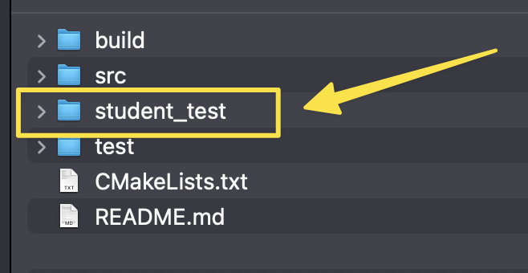
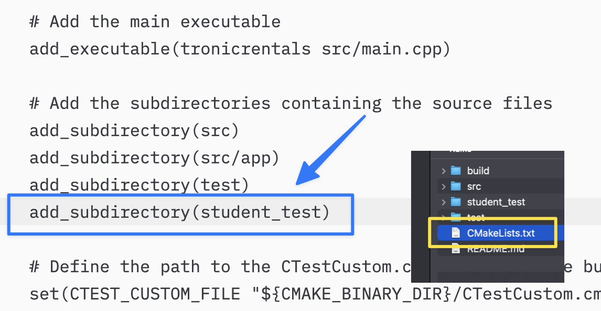

# Student Created Test Cases
A bunch of test cases that I created to assist my Assignment 1 development that may be useful to others

## Install instructions
To install the test cases, first place the "student_test" folder in the base directory of your project, as seen below:

Then, open up the main CMakeLists.txt file found at the root directory of the project, and add the following line as shown below:

Once the student_test folder is added, you will need to delete the old build folder, rebuild the project, and the new test cases should show up in ctest.
